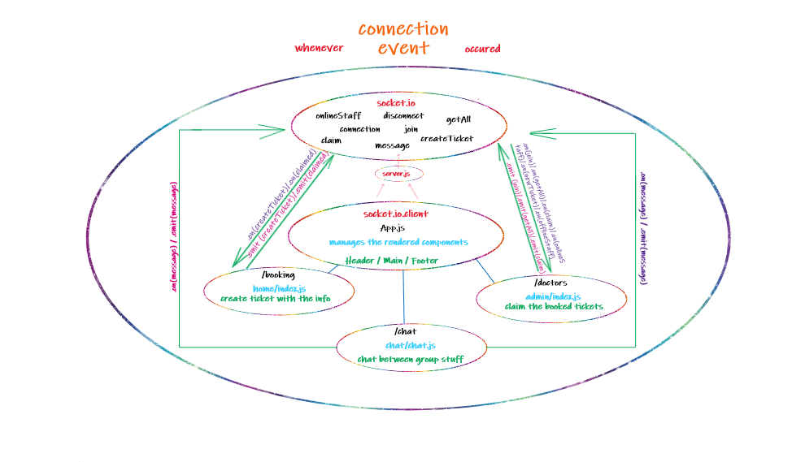

# MCA

## Authors : 

- Dina Khaleel
- Ayah Zaareer

## Project brief : 

* Project Name : MCA Project (medical clinics appointment)

* Project Idea : MCA Project facilates for patient to book an appointment in a medical clinics and provide a feature to contact the doctors directly for urgent cases.
## URLs
* Heroku applications

[Heroku deploynment](https://project-mca-back.herokuapp.com/)

* Netlify applications

[Netlify deploynment](https://quirky-goldstine-e67ff1.netlify.app)

* Github actions

[actions](https://github.com/DinaSami/MCA-Project0/actions)

* pull request

[PR](https://github.com/DinaSami/MCA-Project0/pulls)

## Drawings

* UML  



## instructions

* install the app or library by typing (npm install -the library's name) for server directory

```
npm install socket.io
```

* install the app or library by typing (npm install -the library's name) for mac directory

```
npm install socket.io.client
```

* run the app by typing this command (nodemon) for server directory

```
nodemon
```

* run the app by typing this command (npm start) for mac directory

```
npm init -y
```


